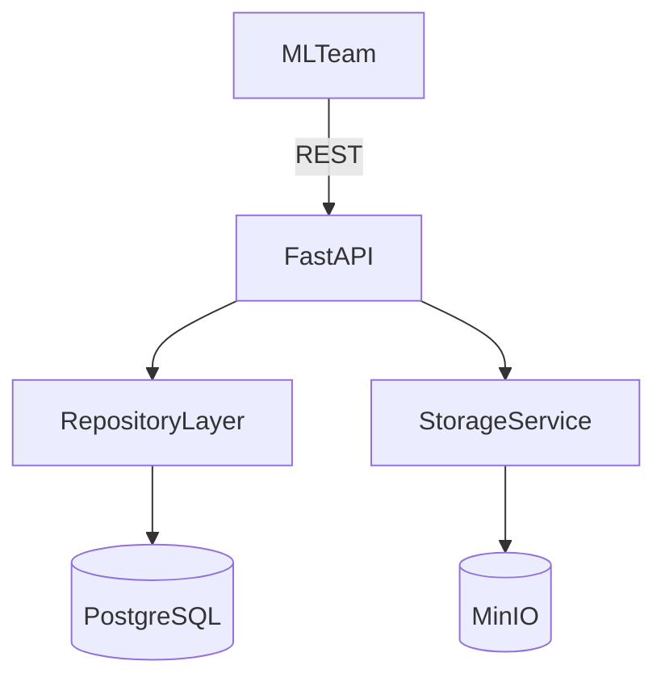

# Model Registry HW

## 1) Проблемы текущего состояния

- Нет единого реестра: модели лежат только в папках.
- Нельзя понять, какая версия актуальна и где `production`.
- Нет метаданных: параметры, метрики, датасет, команда, run_id.
- Нет истории изменений и прозрачных переходов между стадиями.
- Нельзя быстро найти модель по имени/команде/стадии.
- Нет стандартного API для интеграции с пайплайнами.

## 2) Требования

### Функциональные

- Регистрация модели по уникальному имени.
- Создание версий модели с метаданными (`parameters`, `metrics`, `tags`, `run_id`).
- Хранение артефактов версии в объектном хранилище.
- Просмотр, обновление, удаление моделей и версий.
- Перевод версии между стадиями `none/staging/production/archived`.
- Гарантия одной `production` версии на модель.
- Поиск/фильтрация моделей и версий.

### Нефункциональные

- Простое локальное развертывание через Docker Compose.
- Надежное хранение метаданных (PostgreSQL, транзакции).
- Изоляция артефактов и S3-совместимость (MinIO).
- Расширяемая структура кода без оверинжиниринга.
- Тестируемость API и бизнес-логики.

## 3) Архитектура и технологии

- **FastAPI**: HTTP API и контракты.
- **PostgreSQL**: metadata store.
- **MinIO**: artifact store.
- **Repository слой**: отделяет HTTP от работы с БД.
- **Alembic**: версионирование схемы.

## 4) API и схема БД

### API

- `POST /api/v1/models`
- `GET /api/v1/models`
- `GET /api/v1/models/{name}`
- `PATCH /api/v1/models/{name}`
- `DELETE /api/v1/models/{name}`
- `POST /api/v1/models/{name}/versions`
- `GET /api/v1/models/{name}/versions`
- `GET /api/v1/models/{name}/versions/{version}`
- `PATCH /api/v1/models/{name}/versions/{version}`
- `PUT /api/v1/models/{name}/versions/{version}/stage`
- `POST /api/v1/models/{name}/versions/{version}/artifacts`
- `GET /api/v1/models/{name}/versions/{version}/artifacts/{filename}`

### DB schema

`registered_models`
- `id` PK
- `name` UNIQUE NOT NULL
- `description`
- `team`
- `created_at`, `updated_at`

`model_versions`
- `id` PK
- `model_id` FK -> `registered_models.id`
- `version` (уникально в паре `model_id + version`)
- `stage`
- `parameters` JSON(B)
- `metrics` JSON(B)
- `tags` JSON(B)
- `artifact_uri`
- `run_id`
- `description`
- `created_at`, `updated_at`
